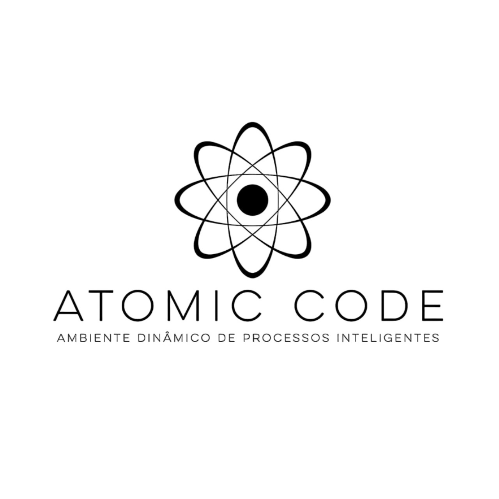
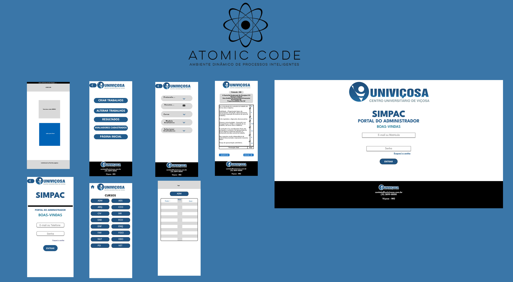

# Estudo de Caso de UX/UI - Projeto SIMPAC

imagem 1

# Visão Geral
## Desafios 
V1 Refinar requisitos de alto nível para nível técnico para auxiliar no desenvolvimento de aplicação web que tem como finalidade promover automatização para o processo de avaliação do simpósio de produção acadêmica (SIMPAC) da UNIVIÇOSA.                                                                  
V2 O SIMPAC, um simpósio acadêmico, enfrenta desafios na entrega eficiente de resultados e na gestão manual das avaliações. O projeto visa otimizar esse processo por meio de uma aplicação que proporciona eficiência na organização de projetos por curso, resultando em entregas mais rápidas e menos trabalho repetitivo para os organizadores.

## Contexto
Atualmente, a equipe da NUPEX (Núcleo de Apoio à Pesquisa e Extensão da Univiçosa) liderada por Eliene da Silva Martins Viana, CEO da NUPEX, realiza o processo de avaliação de forma manual, o que consome tempo, aumenta o risco de erros e dificulta a organização dos dados. A necessidade de uma solução digital para substituir o processo manual tornou-se imperativa, e é neste contexto que o projeto da equipe Atomic Code foi proposto.

# Ciclo de vida
## Ciclo de vida Estrela
O modelo estrela representa o ciclo de vida do desenvolvimento de software, focando em uma abordagem iterativa e centrada no usuário. Este modelo destaca a flexibilidade e a capacidade de adaptação às necessidades e feedback dos usuários ao longo de todo o processo de desenvolvimento. É especialmente útil em projetos onde os requisitos podem mudar frequentemente ou onde a validação contínua com o usuário é essencial para o sucesso do sistema. O modelo estrela promove um desenvolvimento ágil e adaptativo, alinhando-se às práticas modernas de engenharia de software e ao desenvolvimento centrado no usuário, garantindo que o produto final atenda de forma precisa e eficaz às expectativas e necessidades dos seus utilizadores.

imagem 2

# Análise de tarefas usuários e função
.Rebert 

### Usuários-Alvo
- Gestores/Organizadores do SIMPAC
- Avaliadores e Grupos Avaliados
- Público Afetado pelos Resultados

### Ambiente de Utilização
- **Online:**
  - A aplicação é acessada por meio de navegadores web, garantindo acessibilidade a partir de qualquer localização com acesso à internet.

### Objetivos do Projeto
- Automatizar a Organização de Projetos
- Melhorar a Entrega de Resultados
- Otimizar o Tempo

### Análise de tarefas

(Colocar aqui).

---
## Narrativa
Há muito tempo, em um mundo acadêmico não tão distante, um dedicado organizador enfrentava um desafio épico. Seu nome era Marcos, e ele liderava a organização do SIMPAC, um prestigiado simpósio de produção acadêmica. A missão de Marcos era grandiosa: garantir que cada participante recebesse uma avaliação justa e rápida.

No entanto, o destino lhe impôs um obstáculo formidável. Cada processo avaliativo exigia horas intermináveis de trabalho manual, desde a separação dos projetos até o redirecionamento correto. E como se isso não bastasse, o cálculo das notas finais era uma tarefa hercúlea, consumindo não apenas o tempo de Marcos, mas também a paciência de todos os envolvidos.

Em meio a esse cenário desafiador, surge uma luz de esperança. Uma solução inovadora, construída com maestria em Design de Interação (UI) e Experiência do Usuário (UX), estava prestes a transformar a jornada de Marcos. Essa ferramenta revolucionária prometia aliviar o fardo do trabalho manual, trazendo eficiência e agilidade ao processo avaliativo.

Ao adotar essa solução, Marcos não apenas se libertou das amarras do trabalho tedioso, mas também se tornou uma verdadeira heroí na busca por resultados rápidos e justos. O SIMPAC, antes repleto de desafios, floresceu com uma entrega de resultados que deixou todos boquiabertos.

E assim, a história de Marcos e a ferramenta de Design de Interação se tornou um conto lendário no mundo acadêmico. O SIMPAC não era mais apenas um simpósio, mas sim um exemplo vivo de como a inovação, aliada ao design inteligente, pode transformar desafios em triunfos.

No final, Marcos não era apenas um organizador; ela se tornou uma verdadeiro guardião da eficiência, mostrando que, com a ferramenta certa, até mesmo os desafios mais formidáveis podem ser superados. E assim, a cada SIMPAC subsequente, a lembrança da jornada de Marcos continuava a inspirar e guiar aqueles que buscavam a excelência na produção acadêmica.

## Personas
Baseado no storytelling, as personas foram criadas para representar os stakeholders.

imagem 2

imagem 3

Pedro irá refazer as imagens

---

### Mapa de Empatia
- Para entender melhor as necessidades dos stakeholders, utilizamos o mapa de empatia, assim tivemos uma visão de onde focar nossos estudos para criarmos uma solução de agrado a todos.

imagem 4

imagem 5

## Avaliação - análise de tarefa usuários e função
Gabriel  Ribas.

---

# Engenharia de requisitos

## Elicitação de requisitos
ANEXAR AQUI

## Análise de requisitos
ANEXAR AQUI (MODELOS FEITOS) ESII

## Avaliação - Especificação de requisitos
### Validação de requisitos com o cliente
Lucas Santana

# Projeto conceitual e concepção do design
## Identidade visual
Vinicius Fontes

### Design e Iteração
#### Soluções Propostas
- Padronização do Método Avaliativo
- Sistema com Níveis de Acesso
- Criação de Login e Senha para Avaliadores
- Facilidade na Criação e Deleção de Avaliadores
- Comunicação Segura por E-mail e Celular
- Reformulação Geral do Design
- Criação e Edição de Trabalhos Simplificadas

#### Protótipos

- Versão de baixo nível no papel

imagem 7

imagem 8

imagem 9

### Fluxograma
- Foi organizado um fluxograma para orgarnizar as informações, identificar ações que podem ser feitas para os objetivos da organização ou avaliador.

imagem 10

### Wireframe
A partir do fluxograma, foi criado então o wireframe, que é uma representação visual básica e esquemática da estrutura de nossa aplicação web. Seu objetivo principal pe definir a distribuição de elementos da natela, sem se preocupar muito com detalhes visuais.

- Pela tela inicial será possível observar informações como em qual edição o evento se encontra. E qual caminho o usuario gostaria de seguir.
- Para todas escolhas elas serão necessárias um login para confirmar a identidade porém alguns podem ser organizadores e terão um maior nível de acesso.
- O administrador poderá criar os trabalhos para serem avaliados, alterar eles caso tenham cometido erros ou até mesmo apagar, conferir os resultados, checar os avaliadores cadastrados além de poder adicionar ou excluir caso seja necessário.
-  O Avaliador quando terminar suas avaliações lhe será mostrado uma tabela com informações de seus votos e caso o mesmo queira trocar ele terá a oportunidade.
- Para os resultados, que serão disponíveis apenas à organização do evento, lhe será disposto um login e ao entrar, basta escolher o curso que deseja olhar no momento, e será mostrado uma tabela com as notas tanto em poster quanto apresentações orais.

imagem 11

### Protótipo de Media Fidelidade
- Pelo aplicativo Figma foi desenvolvido um protótipo de média fidelidade, com o uso de componentes para simular botões e passando uma ideia de como funcionaria a aplicação.

imagem 13

# Protótipo de Alta Fidelidade

- [Protótipo_Mobile](https://www.figma.com/proto/yDMbtaIZQP5urNRLNSLaIW/SIMPAC-por-Vinicius?type=design&node-id=1-4&t=I9H7ZyO9Fwrh1jV3-1&scaling=scale-down&page-id=32%3A289&starting-point-node-id=1%3A4&show-proto-sidebar=1&mode=design)
- [Protótipo_Desktop](https://www.figma.com/proto/bKh50EThTPfSIAmffkghy4/Untitled?type=design&node-id=0-3&t=LEdIqh2ObP9xoNPn-1&scaling=scale-down-width&page-id=0%3A1&starting-point-node-id=0%3A3&mode=design)

### Conclusão Final
#### Transformando Desafios em Triunfos com o Projeto SIMPAC

Ao longo deste estudo de caso dedicado à melhoria da experiência de organizadores, avaliadores e demais stakeholders do SIMPAC, mergulhamos em uma jornada de inovação guiada pelo Design de Interação (UI) e pela Experiência do Usuário (UX). Este projeto, sob a liderança visionária de Marcos Vinícius Costa Coelho, CEO da Atomic Code, não apenas enfrentou os desafios preexistentes, mas os transformou em triunfos.
Impacto Geral no Usuário:

O novo design e a estrutura de interação propostos foram cuidadosamente elaborados para proporcionar uma experiência fluida e eficiente. Ao automatizar a organização de projetos, padronizar métodos avaliativos e oferecer níveis de acesso personalizados, alcançamos um impacto significativo na jornada dos usuários-alvo. Os gestores do SIMPAC agora desfrutam de uma gestão simplificada, avaliadores têm processos otimizados e o público afetado pelos resultados beneficia-se de entregas mais rápidas e precisas.
Benefícios Alcançados com o Novo Design:

- Eficiência Operacional: A automação da organização de projetos resultou em uma significativa redução do trabalho manual, liberando tempo valioso para os organizadores focarem em aspectos estratégicos.

- Agilidade na Entrega de Resultados: A padronização dos métodos avaliativos e a criação de um sistema de níveis de acesso permitiram uma análise mais rápida e justa, proporcionando resultados precisos em tempo hábil.

- Facilidade de Uso: A reformulação do design, desde a interface até a navegação, transformou a aplicação em uma ferramenta intuitiva e de fácil utilização, promovendo a adesão dos usuários.

- Segurança e Comunicação Aprimoradas: A introdução de login e senha para avaliadores, juntamente com a comunicação segura por e-mail e celular, fortaleceu a segurança do sistema e facilitou a comunicação entre os envolvidos.

## Agradecimentos e Reconhecimentos:

Este projeto não teria sido possível sem a colaboração dedicada de uma equipe multifuncional. Agradecemos especialmente a **Marcos Vinícius Costa Coelho, Vinicius Fontes, Higor Luiz Saraiva Rigueira Queiroz, Gabriel Ribas Pena e João Victor Gomes Lopes de Abreu**, cujas habilidades, insights e esforços foram fundamentais em cada fase do projeto.
Considerações Finais:

O SIMPAC não é mais apenas um simpósio; tornou-se um exemplo vivo de como a inovação, aliada ao design inteligente, pode transformar desafios em triunfos. A história de Marcos e a ferramenta de Design de Interação agora são parte integrante do legado do SIMPAC, inspirando futuras edições a alcançarem a excelência na produção acadêmica. Este projeto não é apenas uma conclusão; é um convite para um novo capítulo de eficiência, agilidade e excelência no mundo acadêmico.

Agradecemos a todos os envolvidos por fazerem do SIMPAC um verdadeiro marco na interseção entre tecnologia, design e produção acadêmica. Que esta jornada inspire muitos outros a transformarem desafios em oportunidades de triunfo.

### Envolvidos no Projeto
- **Equipe de Design e Desenvolvimento:**
- Antônio Henrico Aguiar Lopes (CEO)
- Vinicius Fontes
- Lucas Fontes 
- Gabriel Ribas Pena 
- André 
- Pedro 
- **Clientes e Stakeholders:**
  - NUPEX - Núcleo de Ensino, Pesquisa e Extensão
  - Eliene Coordenadora SIMPAC

