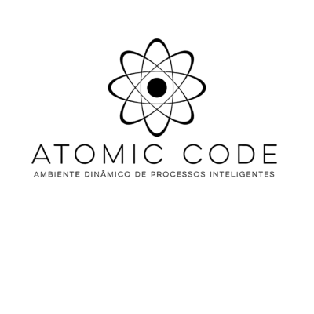

# Projeto Evoluir

Figura 1

# Projeto SIMPAC

# Visão Geral
## Desafios 
V1 Refinar requisitos de alto nível para nível técnico para auxiliar no desenvolvimento de aplicação web que tem como finalidade promover automatização para o processo de avaliação do simpósio de produção acadêmica (SIMPAC) da UNIVIÇOSA.                                                                  
V2 O SIMPAC, um simpósio acadêmico, enfrenta desafios na entrega eficiente de resultados e na gestão manual das avaliações. O projeto visa otimizar esse processo por meio de uma aplicação que proporciona eficiência na organização de projetos por curso, resultando em entregas mais rápidas e menos trabalho repetitivo para os organizadores.

## Contexto
Atualmente, a equipe da NUPEX (Núcleo de Apoio à Pesquisa e Extensão da Univiçosa) liderada por Eliene da Silva Martins Viana, CEO da NUPEX, realiza o processo de avaliação de forma manual, o que consome tempo, aumenta o risco de erros e dificulta a organização dos dados. A necessidade de uma solução digital para substituir o processo manual tornou-se imperativa, e é neste contexto que o projeto da equipe Atomic Code foi proposto.

# Ciclo de vida
## Ciclo de vida Estrela
O modelo estrela representa o ciclo de vida do desenvolvimento de software, focando em uma abordagem iterativa e centrada no usuário. Este modelo destaca a flexibilidade e a capacidade de adaptação às necessidades e feedback dos usuários ao longo de todo o processo de desenvolvimento. É especialmente útil em projetos onde os requisitos podem mudar frequentemente ou onde a validação contínua com o usuário é essencial para o sucesso do sistema. O modelo estrela promove um desenvolvimento ágil e adaptativo, alinhando-se às práticas modernas de engenharia de software e ao desenvolvimento centrado no usuário, garantindo que o produto final atenda de forma precisa e eficaz às expectativas e necessidades dos seus utilizadores.

imagem 2

# Análise de tarefas usuários e função

## WHY (Motivo e Objetivo do Sistema)
A implementação deste sistema é fundamentada em uma série de razões estratégicas e
funcionais, visando aprimorar a eficiência, a colaboração e a experiência global no
gerenciamento de projetos do SIMPAC. Abaixo estão os principais motivos que respaldam
a adoção deste sistema.

### Otimização da Eficiência Operacional 
O sistema oferece uma plataforma centralizada e integrada, permitindo
aos administradores e avaliadores gerenciarem dados, prazos e notificações de
forma eficiente. Isso resulta em uma redução significativa no tempo dedicado a
tarefas administrativas, liberando recursos para focar em atividades mais
estratégicas.

### Aprimoramento da Colaboração 
A implementação do sistema promove uma comunicação mais eficaz
entre administradores, avaliadores e participantes. Facilita a troca de
informações, feedbacks e atualizações em tempo real, fortalecendo a
colaboração e a sinergia na comunidade acadêmica. 

### Facilidade de Acesso e Usabilidade 
Por quê: A natureza baseada na web do sistema proporciona acessibilidade
global, permitindo que usuários acessem a plataforma de qualquer lugar, a
qualquer momento. Sua interface intuitiva e amigável facilita a adoção e o uso
efetivo, independentemente do nível de familiaridade com tecnologia. 

### Transparência e Acompanhamento 
O sistema oferece transparência no processo de submissão e avaliação
de projetos, prazos e feedbacks. Isso permite que administradores, avaliadores e
participantes acompanhem o progresso dos projetos de forma clara e eficaz,
resultando em uma gestão mais informada e eficiente

### Segurança de Dados e Controle de Acesso 
A implementação do sistema promove a segurança de dados, com a
utilização de protocolos modernos de criptografia e práticas de segurança. O
controle de acesso é centralizado, permitindo que administradores definam
permissões de forma granular, garantindo a confidencialidade e a integridade dos
dados. 

## Objetivo do Sistema 

Após a reunião, pensamos em um projeto com o objetivo de facilitar os processos, com
as principais funções:
- Cadastro de Administradores, Avaliadores e Avaliações.
- Acesso para todos que quiserem ver os resultados dos projetos.
- Menu para escolha de login para Administradores e Avaliadores.
- Menu de acesso para ver os resultados dos projetos.
- Redução do trabalho manual para otimizar o tempo gasto. 

Administradores e avaliadores deverão acessar o sistema utilizando um e-mail e senha de
segurança para garantir a proteção dos dados e a integridade das avaliações.
O sistema contará com recursos que permitirão que todos os usuários possam acessá-lo
para ver os resultados dos projetos. No entanto, o acesso a informações privadas será
restrito, com cadastro permitido apenas para pessoas autorizadas, tais como:
Professores envolvidos, Avaliadores e Administradores.
O sistema será acessível via web, garantindo
flexibilidade e conveniência para todos os usuários. 

### Quais seriam os problemas? 

- Tentativa de cadastro de projetos a serem avaliados faltando dados no formulário.
- Atrasos na conclusão das tarefas devido ao serviço ser feito de forma manual,
afetando outras pessoas envolvidas. 

### Usuários-Alvo
- Gestores/Organizadores do SIMPAC
- Avaliadores e Grupos Avaliados
- Público Afetado pelos Resultados

(Colocar aqui).

---
## Narrativa
Há muito tempo, em um mundo acadêmico não tão distante, um dedicado organizador enfrentava um desafio épico. Seu nome era Marcos, e ele liderava a organização do SIMPAC, um prestigiado simpósio de produção acadêmica. A missão de Marcos era grandiosa: garantir que cada participante recebesse uma avaliação justa e rápida.

No entanto, o destino lhe impôs um obstáculo formidável. Cada processo avaliativo exigia horas intermináveis de trabalho manual, desde a separação dos projetos até o redirecionamento correto. E como se isso não bastasse, o cálculo das notas finais era uma tarefa hercúlea, consumindo não apenas o tempo de Marcos, mas também a paciência de todos os envolvidos.

Em meio a esse cenário desafiador, surge uma luz de esperança. Uma solução inovadora, construída com maestria em Design de Interação (UI) e Experiência do Usuário (UX), estava prestes a transformar a jornada de Marcos. Essa ferramenta revolucionária prometia aliviar o fardo do trabalho manual, trazendo eficiência e agilidade ao processo avaliativo.

Ao adotar essa solução, Marcos não apenas se libertou das amarras do trabalho tedioso, mas também se tornou uma verdadeira heroí na busca por resultados rápidos e justos. O SIMPAC, antes repleto de desafios, floresceu com uma entrega de resultados que deixou todos boquiabertos.

E assim, a história de Marcos e a ferramenta de Design de Interação se tornou um conto lendário no mundo acadêmico. O SIMPAC não era mais apenas um simpósio, mas sim um exemplo vivo de como a inovação, aliada ao design inteligente, pode transformar desafios em triunfos.

No final, Marcos não era apenas um organizador; ela se tornou uma verdadeiro guardião da eficiência, mostrando que, com a ferramenta certa, até mesmo os desafios mais formidáveis podem ser superados. E assim, a cada SIMPAC subsequente, a lembrança da jornada de Marcos continuava a inspirar e guiar aqueles que buscavam a excelência na produção acadêmica.

## Personas
Baseado no storytelling, as personas foram criadas para representar os stakeholders.

imagem 2

imagem 3

Pedro irá refazer as imagens

---

### Mapa de Empatia
- Para entender melhor as necessidades dos stakeholders, utilizamos o mapa de empatia, assim tivemos uma visão de onde focar nossos estudos para criarmos uma solução de agrado a todos.

imagem 4

imagem 5

## Avaliação - análise de tarefa usuários e função
Gabriel  Ribas.

---

# Engenharia de requisitos

## Elicitação de requisitos
ANEXAR AQUI
## Análise de requisitos
### Fluxograma
- Foi organizado um fluxograma para orgarnizar as informações, identificar ações que podem ser feitas para os objetivos da organização ou avaliador.

imagem XX

ANEXAR AQUI (MODELOS FEITOS) ESII

## Avaliação - Especificação de requisitos
### Validação de requisitos com o cliente
Lucas Santana

# Projeto conceitual e concepção do design
## Identidade visual
Vinicius Fontes

### Design e Iteração
#### Soluções Propostas
- Padronização do Método Avaliativo
- Sistema com Níveis de Acesso
- Criação de Login e Senha para Avaliadores
- Facilidade na Criação e Deleção de Avaliadores
- Comunicação Segura por E-mail e Celular
- Reformulação Geral do Design
- Criação e Edição de Trabalhos Simplificadas

### Wireframe
A partir do fluxograma, foi criado então o wireframe, que é uma representação visual básica e esquemática da estrutura de nossa aplicação web. Seu objetivo principal pe definir a distribuição de elementos da natela, sem se preocupar muito com detalhes visuais.

- Pela tela inicial será possível observar informações como em qual edição o evento se encontra. E qual caminho o usuario gostaria de seguir.
- Para todas escolhas elas serão necessárias um login para confirmar a identidade porém alguns podem ser organizadores e terão um maior nível de acesso.
- O administrador poderá criar os trabalhos para serem avaliados, alterar eles caso tenham cometido erros ou até mesmo apagar, conferir os resultados, checar os avaliadores cadastrados além de poder adicionar ou excluir caso seja necessário.
-  O Avaliador quando terminar suas avaliações lhe será mostrado uma tabela com informações de seus votos e caso o mesmo queira trocar ele terá a oportunidade.
- Para os resultados, que serão disponíveis apenas à organização do evento, lhe será disposto um login e ao entrar, basta escolher o curso que deseja olhar no momento, e será mostrado uma tabela com as notas tanto em poster quanto apresentações orais.

imagem XX

# Protótipos

## Versão de baixa fidelidade

imagem XX

imagem XX

imagem XX

## Protótipo de Media Fidelidade
- Pelo aplicativo Figma foi desenvolvido um protótipo de média fidelidade, com o uso de componentes para simular botões e passando uma ideia de como funcionaria a aplicação.

imagem XX

## Protótipo de Alta Fidelidade

- [Protótipo_Mobile](https://www.figma.com/proto/yDMbtaIZQP5urNRLNSLaIW/SIMPAC-por-Vinicius?type=design&node-id=1-4&t=I9H7ZyO9Fwrh1jV3-1&scaling=scale-down&page-id=32%3A289&starting-point-node-id=1%3A4&show-proto-sidebar=1&mode=design)
- [Protótipo_Desktop](https://www.figma.com/proto/bKh50EThTPfSIAmffkghy4/Untitled?type=design&node-id=0-3&t=LEdIqh2ObP9xoNPn-1&scaling=scale-down-width&page-id=0%3A1&starting-point-node-id=0%3A3&mode=design)

# Implementação
O projeto atual está sendo desenvolvido com base nas matérias de Interação Humano Computador e Engenharia de Software II, a implementação do trabalho em questão será feita no próximo semestre na matéria de Arquitetura de Software e Projeto Integrador.

### Envolvidos no Projeto
- **Equipe de Design e Desenvolvimento:**
- Antônio Henrico Aguiar Lopes (CEO)
- Vinicius Fontes
- Lucas Fontes 
- Gabriel Ribas Pena 
- André 
- Pedro 
- **Clientes e Stakeholders:**
  - NUPEX - Núcleo de Ensino, Pesquisa e Extensão
  - Eliene - Coordenadora SIMPAC
    

