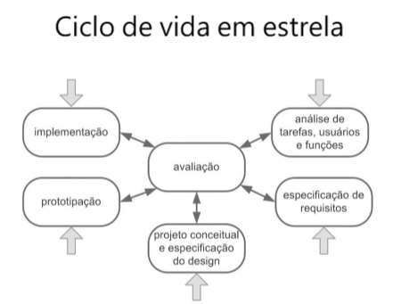

# Projeto Evoluir
### Projeto SIMPAC

  
   
  Figura 1 - Logo da Atomic Code

# Visão Geral
## Desafios 
O SIMPAC, um simpósio acadêmico, enfrenta desafios na entrega eficiente de resultados e na gestão manual das avaliações. O projeto visa otimizar esse processo por meio de uma aplicação que proporciona eficiência na organização de projetos por curso, resultando em entregas mais rápidas e menos trabalho repetitivo para os organizadores.

## Contexto
Atualmente, a equipe da NUPEX (Núcleo de Apoio à Pesquisa e Extensão da Univiçosa) liderada por Eliene da Silva Martins Viana, CEO da NUPEX, realiza o processo de avaliação de forma manual, o que consome tempo, aumenta o risco de erros e dificulta a organização dos dados. A necessidade de uma solução digital para substituir o processo manual tornou-se imperativa, e é neste contexto que o projeto da equipe Atomic Code foi proposto.

# Ciclo de vida
## Ciclo de vida Estrela
O modelo estrela representa o ciclo de vida do desenvolvimento de software, focando em uma abordagem iterativa e centrada no usuário. Este modelo destaca a flexibilidade e a capacidade de adaptação às necessidades e feedback dos usuários ao longo de todo o processo de desenvolvimento. É especialmente útil em projetos onde os requisitos podem mudar frequentemente ou onde a validação contínua com o usuário é essencial para o sucesso do sistema. O modelo estrela promove um desenvolvimento ágil e adaptativo, alinhando-se às práticas modernas de engenharia de software e ao desenvolvimento centrado no usuário, garantindo que o produto final atenda de forma precisa e eficaz às expectativas e necessidades dos seus utilizadores.

  
   
  Figura 2 - Ciclo de vida em estrela

# Análise de tarefas usuários e função

## WHY

### CENÁRIO ATUAL
Atualmente, durante o SIMPAC (Simpósio de Pesquisa e Extensão da Univiçosa), o processo de avaliação é organizado pela equipe da NUPEX (Núcleo de Apoio à Pesquisa e Extensão da Univiçosa), sob a liderança de Eliene da Silva Martins Viana. Este processo é realizado manualmente, o que demanda um considerável investimento de tempo, aumentando os riscos de erros e tornando a organização dos dados mais desafiadora. A necessidade de uma solução digital para substituir esse método tornou-se crucial, considerando a importância do SIMPAC e a demanda por eficiência e precisão nas avaliações. É nesse contexto que o projeto da equipe Atomic Code foi proposto, com o objetivo de oferecer uma solução automatizada e integrada para otimizar o processo de avaliação durante o SIMPAC.

### Motivo e Objetivo do Sistema

A implementação deste sistema é fundamentada em uma série de razões estratégicas e
funcionais, visando aprimorar a eficiência, a colaboração e a experiência global no
gerenciamento de projetos do SIMPAC. Abaixo estão os principais motivos que respaldam
a adoção deste sistema.

### Otimização da Eficiência Operacional 
O sistema oferece uma plataforma centralizada e integrada, permitindo
aos administradores e avaliadores gerenciarem dados, prazos e notificações de
forma eficiente. Isso resulta em uma redução significativa no tempo dedicado a
tarefas administrativas, liberando recursos para focar em atividades mais
estratégicas.

### Aprimoramento da Colaboração 
A implementação do sistema promove uma comunicação mais eficaz
entre administradores, avaliadores e participantes. Facilita a troca de
informações, feedbacks e atualizações em tempo real, fortalecendo a
colaboração e a sinergia na comunidade acadêmica. 

### Facilidade de Acesso e Usabilidade 
Por quê: A natureza baseada na web do sistema proporciona acessibilidade
global, permitindo que usuários acessem a plataforma de qualquer lugar, a
qualquer momento. Sua interface intuitiva e amigável facilita a adoção e o uso
efetivo, independentemente do nível de familiaridade com tecnologia. 

### Transparência e Acompanhamento 
O sistema oferece transparência no processo de submissão e avaliação
de projetos, prazos e feedbacks. Isso permite que administradores, avaliadores e
participantes acompanhem o progresso dos projetos de forma clara e eficaz,
resultando em uma gestão mais informada e eficiente

### Segurança de Dados e Controle de Acesso 
A implementação do sistema promove a segurança de dados, com a
utilização de protocolos modernos de criptografia e práticas de segurança. O
controle de acesso é centralizado, permitindo que administradores definam
permissões de forma granular, garantindo a confidencialidade e a integridade dos
dados. 

## Objetivo do Sistema 

Após a reunião, pensamos em um projeto com o objetivo de facilitar os processos, com
as principais funções:
- Cadastro de Administradores, Avaliadores e Avaliações.
- Acesso para todos que quiserem ver os resultados dos projetos.
- Menu para escolha de login para Administradores e Avaliadores.
- Menu de acesso para ver os resultados dos projetos.
- Redução do trabalho manual para otimizar o tempo gasto. 

Administradores e avaliadores deverão acessar o sistema utilizando um e-mail e senha de
segurança para garantir a proteção dos dados e a integridade das avaliações.
O sistema contará com recursos que permitirão que todos os usuários possam acessá-lo
para ver os resultados dos projetos. No entanto, o acesso a informações privadas será
restrito, com cadastro permitido apenas para pessoas autorizadas, tais como:
Professores envolvidos, Avaliadores e Administradores.
O sistema será acessível via web, garantindo
flexibilidade e conveniência para todos os usuários. 

### Quais seriam os problemas? 

- Tentativa de cadastro de projetos a serem avaliados faltando dados no formulário.
- Atrasos na conclusão das tarefas devido ao serviço ser feito de forma manual,
afetando outras pessoas envolvidas. 

### Usuários-Alvo
- Gestores/Organizadores do SIMPAC
- Avaliadores e Grupos Avaliados
- Público Afetado pelos Resultados

## Narrativa
Há muito tempo, em um mundo acadêmico não tão distante, um dedicado organizador enfrentava um desafio épico. Seu nome era Marcos, e ele liderava a organização do SIMPAC, um prestigiado simpósio de produção acadêmica. A missão de Marcos era grandiosa: garantir que cada participante recebesse uma avaliação justa e rápida.

No entanto, o destino lhe impôs um obstáculo formidável. Cada processo avaliativo exigia horas intermináveis de trabalho manual, desde a separação dos projetos até o redirecionamento correto. E como se isso não bastasse, o cálculo das notas finais era uma tarefa hercúlea, consumindo não apenas o tempo de Marcos, mas também a paciência de todos os envolvidos.

Em meio a esse cenário desafiador, surge uma luz de esperança. Uma solução inovadora, construída com maestria em Design de Interação (UI) e Experiência do Usuário (UX), estava prestes a transformar a jornada de Marcos. Essa ferramenta revolucionária prometia aliviar o fardo do trabalho manual, trazendo eficiência e agilidade ao processo avaliativo.

Ao adotar essa solução, Marcos não apenas se libertou das amarras do trabalho tedioso, mas também se tornou uma verdadeira heroí na busca por resultados rápidos e justos. O SIMPAC, antes repleto de desafios, floresceu com uma entrega de resultados que deixou todos boquiabertos.

E assim, a história de Marcos e a ferramenta de Design de Interação se tornou um conto lendário no mundo acadêmico. O SIMPAC não era mais apenas um simpósio, mas sim um exemplo vivo de como a inovação, aliada ao design inteligente, pode transformar desafios em triunfos.

No final, Marcos não era apenas um organizador; ela se tornou uma verdadeiro guardião da eficiência, mostrando que, com a ferramenta certa, até mesmo os desafios mais formidáveis podem ser superados. E assim, a cada SIMPAC subsequente, a lembrança da jornada de Marcos continuava a inspirar e guiar aqueles que buscavam a excelência na produção acadêmica.

## OMS - Análise das Partes Interessadas

### Personas
Baseado no storytelling, as personas foram criadas para representar os stakeholders.

Figura 3 - Persona de Marcos Silva

Figura 4 - Persona Luana Pereira

### Mapa de Empatia
- Para entender melhor as necessidades dos stakeholders, utilizamos o mapa de empatia, assim tivemos uma visão de onde focar nossos estudos para criarmos uma solução de agrado a todos.

Figura 5 - Mapa de Empatia Marcos Silva

Figura 6 - Mapa e Empatia de Luana Pereira

## Avaliação - análise de tarefa usuários e função
Gabriel  Ribas.

---

## Engenharia de requisitos

### Elicitação de requisitos

A Elicitação de requisitos foi realizada através de uma reunião com um cliente que junto com nossa equipe foram levantados os requisitos para resolver o atual problema da avalição do SIMPAC, estes requisitos foram documentados a nível de usuário, ou seja, a um nível de explicação mais simples que o próprio cliente consegue compreender.

- [Documento de requisitos a nível de usuário](Processos/Sprint_3/Requisitos_de_usuário.pdf)

### Análise de requisitos
#### Casos de Uso
Usuários Principais

Admin: O administrador do sistema, que tem várias responsabilidades de gerenciamento.

Avaliador: A pessoa que realiza as avaliações dos trabalhos.

Usuário: Qualquer pessoa que utiliza o sistema para ver resultados e outras informações.

Funcionalidades do Sistema

Login e Logout

Todos os usuários podem entrar e sair do sistema com segurança.

Gerenciamento de Trabalhos

Os administradores podem criar, editar e organizar os trabalhos que precisam ser avaliados.

Atribuição de Avaliadores

Os administradores designam avaliadores específicos para cada trabalho.

Gerenciamento de Avaliadores

Os administradores também gerenciam o cadastro e as informações dos avaliadores.

Visualização de Trabalhos

Todos os usuários podem ver quais trabalhos estão disponíveis no sistema.

Realização de Avaliações

Os avaliadores realizam as avaliações dos trabalhos atribuídos a eles, seguindo critérios específicos.

Visualização de Avaliações

Os usuários podem ver as avaliações que foram feitas.

Visualização de Resultados

Os usuários podem ver os resultados finais das avaliações de cada trabalho.

Como Tudo se Conecta

O sistema é bem interligado. Algumas funcionalidades dependem de outras. Por exemplo, para realizar uma avaliação, é necessário que o trabalho já tenha sido gerenciado e um avaliador tenha sido atribuído. Assim, o fluxo de atividades é contínuo e organizado.

Conclusão

Este sistema é essencial para manter o processo de avaliação eficiente e organizado. Ele garante que os administradores possam gerenciar tudo de forma eficaz, que os avaliadores façam suas tarefas de maneira estruturada, e que todos os usuários tenham acesso fácil às informações de que precisam.
[Diagráma casos de uso](https://drive.google.com/file/d/1HSCV19wCrxr_p65Y4pJA0-9oUrmQJJSd/view?usp=sharing)  
#### Sequência
[Diagráma de sequência](https://drive.google.com/file/d/1kqzm1ggbv5xz82-ZDJbS10ESY5_t3-ZP/view?usp=sharing)  
#### Classes
[Diagráma de classes](https://drive.google.com/file/d/1AuMt8c_RJhknCfidFCA7WQmffumdQa0K/view?usp=sharing)  
#### Colaboração
[Diagráma de colaboração](https://drive.google.com/file/d/17flyofmhTykFYNmgYqyAsTEph1lcKjSO/view?usp=sharing)  
#### Estados
Para o sistema de gerenciamento de submissão e avaliação de projetos SIMPAC, o diagrama de estado pode ser usado da seguinte maneira: Administradores e Avaliadores: Login: Administradores e avaliadores usam o diagrama para entender o fluxo de login, incluindo o que acontece em caso de sucesso ou falha. Cadastro e Avaliação: O diagrama mostra claramente como os administradores cadastram novos projetos e como os avaliadores realizam suas avaliações, incluindo possíveis erros e suas correções .Usuários do Sistema: Visualização de Resultados: O diagrama ajuda os usuários a entender como podem acessar os resultados das avaliações de projetos, partindo do menu principal. Desenvolvimento e Manutenção: implementação: Os desenvolvedores seguem o diagrama para garantir que todos os estados e transições estão implementados corretamente. Atualizações: Em caso de atualizações ou manutenção do sistema, o diagrama ajuda a identificar rapidamente como novos estados ou transições devem ser adicionados ou modificados. O diagrama de estado é, portanto, uma ferramenta poderosa para visualizar, planejar, implementar e manter sistemas complexos, garantindo que todos os aspectos do comportamento do sistema sejam compreendidos e bem gerenciados.
[Diagráma de estados](https://drive.google.com/file/d/17flyofmhTykFYNmgYqyAsTEph1lcKjSO/view?usp=sharing)  
#### Atividades
[Diagráma de atividades](https://drive.google.com/file/d/1QDAD4aZ3M_reVsbW9c4UJNqmsZpzd4px/view?usp=sharing)  

### Fluxograma
- Foi organizado um fluxograma para orgarnizar as informações, identificar ações que podem ser feitas para os objetivos da organização ou avaliador.

Figura 7 - Fluxo Grama do sitema

ANEXAR AQUI (MODELOS FEITOS) ESII

## Especificação de requisitos
Foi realizado o refinamento dos requisitos que compunham o nível de usuário para o nível de sistema para auxiliar os programadores na etapa de desenvolvimento do sistema.

- [Documento de requisitos a nível de sistema](Processos/Sprint_3/Requisitos_do_Sistema_para_o_Projeto_SIMPAC.pdf)

## Avaliação - Especificação de requisitos,
### Validação de requisitos com o cliente
- Entramos em contato com a cliente por meio do aplicativo de mensagens WhatsApp para validar os requisitos de usuário e de sistema.
- Os responsáveis pelo projeto apresentaram algumas dúvidas sobre o protótipo que não ficaram claras.
- Anotamos as correções necessárias para realizar as alterações no protótipo.
- A cliente assinou o Documento de Validação de Requisitos, contendo os requisitos de usuário e de sistema, validando assim os requisitos.

## Projeto conceitual e concepção do design
### Identidade visual

#### Elementos Principais:

- Imagem 1: Representa o "Simpósio de Produção Acadêmica," destacando a interação e apresentação de trabalhos acadêmicos.

- Imagem 2: Representa o "Sistema para calcular os resultados de maneira rápida e eficaz," destacando a automatização e eficiência do sistema.

Logotipo:

- Nome: Utilizado com a fonte específica da que estava no site da univicosa.

- Símbolo: Inclui a edição do simpósio, representada pelo elemento "XV" no exemplo, que pode ser atualizado conforme necessário.

  
   
  Figura XX

#### Tipografia:

- A fonte utilizada é "League Spartan" em suas variações Bold e Regular.

Paleta de Cores:

- #000000 (Preto): Cor sólida que passa uma sensação de seriedade e formalidade.

- #205483 (Azul Escuro): Transmite confiança, segurança e estabilidade. mantendo a identidade visual da faculdade.

- #00AFEFF (Azul Claro): Cor vibrante que sugere modernidade e dinamismo.

- #2C2D48 (Azul Marinho): Cor elegante e profissional que complementa as outras tonalidades de azul.

- #FFFFFF (Branco): Representa clareza e simplicidade, utilizada como cor de fundo para contrastar com as demais cores.

### Design e Iteração
#### Soluções Propostas
- Padronização do Método Avaliativo
- Sistema com Níveis de Acesso
- Criação de Login e Senha para Avaliadores
- Facilidade na Criação e Deleção de Avaliadores
- Comunicação Segura por E-mail e Celular
- Reformulação Geral do Design
- Criação e Edição de Trabalhos Simplificadas

## Wireframe
A partir do fluxograma, foi criado então o wireframe, que é uma representação visual básica e esquemática da estrutura de nossa aplicação web. Seu objetivo principal pe definir a distribuição de elementos da natela, sem se preocupar muito com detalhes visuais.

- Pela tela inicial será possível observar informações como em qual edição o evento se encontra. E qual caminho o usuario gostaria de seguir.
- Para todas escolhas elas serão necessárias um login para confirmar a identidade porém alguns podem ser organizadores e terão um maior nível de acesso.
- O administrador poderá criar os trabalhos para serem avaliados, alterar eles caso tenham cometido erros ou até mesmo apagar, conferir os resultados, checar os avaliadores cadastrados além de poder adicionar ou excluir caso seja necessário.
-  O Avaliador quando terminar suas avaliações lhe será mostrado uma tabela com informações de seus votos e caso o mesmo queira trocar ele terá a oportunidade.
- Para os resultados, que serão disponíveis apenas à organização do evento, lhe será disposto um login e ao entrar, basta escolher o curso que deseja olhar no momento, e será mostrado uma tabela com as notas tanto em poster quanto apresentações orais.

### Versão de baixa fidelidade

imagem XX

imagem XX

imagem XX

Figura XX - WireFrame Final

# Protótipo de Alta Fidelidade
## Prototipação

O Figma foi utilizado como ferramenta de prototipação desenolvendo assim o prototipo de alta fidelidade, corrigndo alguns pontos e refinando ainda mais a usabilidade do sistema para fornecer uma experiência mais agradável aos usuários.
-Existem dois protótipos, o desenvolvido pensado em dispositivos móveis e desktop.

- [Protótipo_Mobile](https://www.figma.com/proto/yDMbtaIZQP5urNRLNSLaIW/SIMPAC-por-Vinicius?type=design&node-id=1-4&t=I9H7ZyO9Fwrh1jV3-1&scaling=scale-down&page-id=32%3A289&starting-point-node-id=1%3A4&show-proto-sidebar=1&mode=design)
- [Protótipo_Desktop](https://www.figma.com/proto/bKh50EThTPfSIAmffkghy4/Untitled?type=design&node-id=0-3&t=LEdIqh2ObP9xoNPn-1&scaling=scale-down-width&page-id=0%3A1&starting-point-node-id=0%3A3&mode=design)

## Avaliação do protótipo
[AINDA NÃO FEITO]
# Processo contínuo

- [Vídeo explicativo sobre o protótipo]
- Sera realizado um Pitch do projeto ao cliente, especialistas e investidores, frisar novamente todas as funcionalidades do protótipo e mostrar o sitema (protótipo), e como iria auxilar as partes interessadas (avaliadores e avaliados no SIMPAC) a solucinar os problemas relacionados a falta de informatização no processo de avaliação de projetos do SIMPAC-UNIVIÇOSA;

# Implementação
O projeto atual está sendo desenvolvido com base nas matérias de Interação Humano Computador e Engenharia de Software II, a implementação do trabalho em questão será feita no próximo semestre na matéria de Arquitetura de Software e Projeto Integrador.

### Esse projeto foi desenvolvido por:

- Antônio Henrico Aguiar Lopes, Estudante de Desenvolvimento de Software da UNIVIÇOSA
- Vinicius Fontes, Estudante de Desenvolvimento de Software da UNIVIÇOSA
- Lucas Fontes, Estudante de Desenvolvimento de Software da UNIVIÇOSA
- Gabriel Ribas Pena, Estudante de Desenvolvimento de Software da UNIVIÇOSA
- André, Estudante de Desenvolvimento de Software da UNIVIÇOSA
- Pedro, Estudante de Desenvolvimento de Software da UNIVIÇOSA
- Reberth, Estudante de Desenvolvimento de Software da UNIVIÇOSA
    

